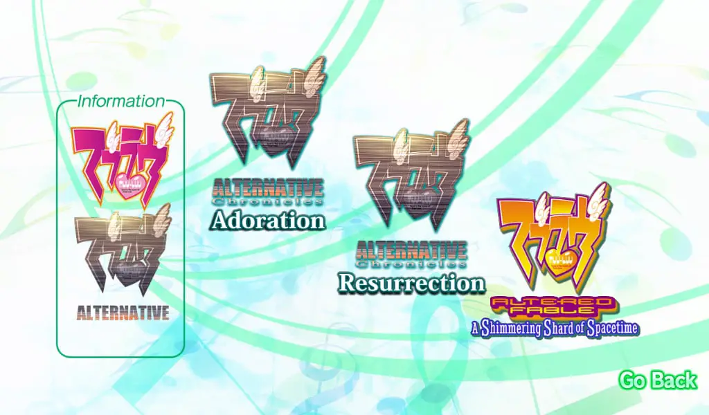
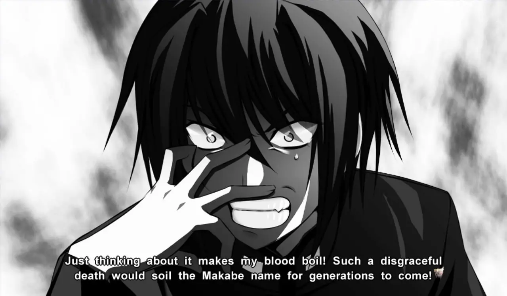
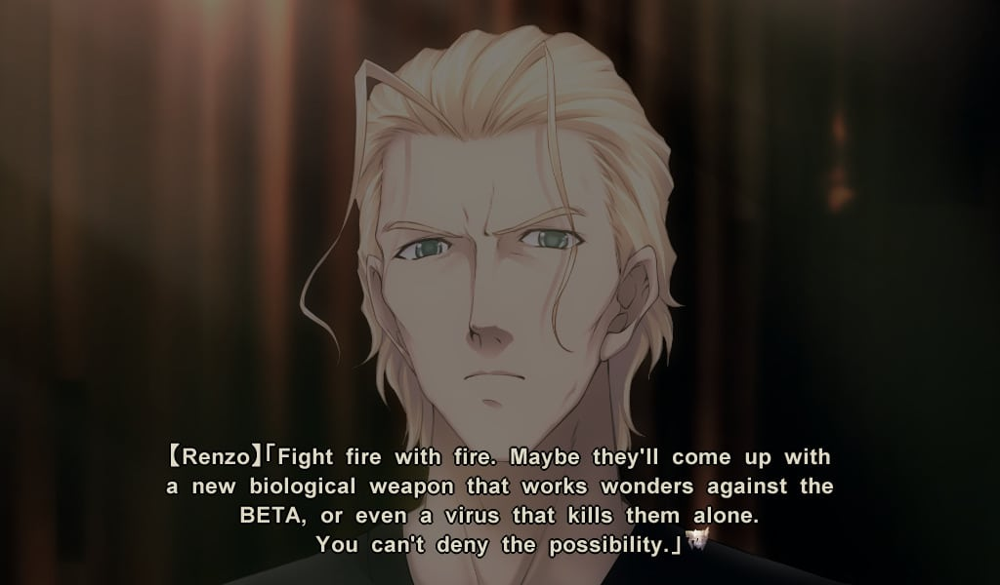
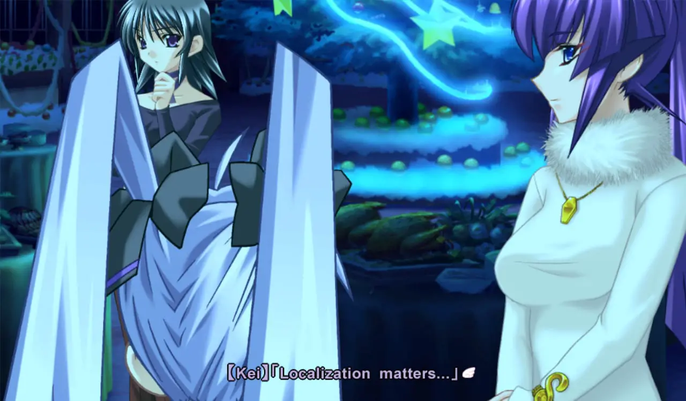
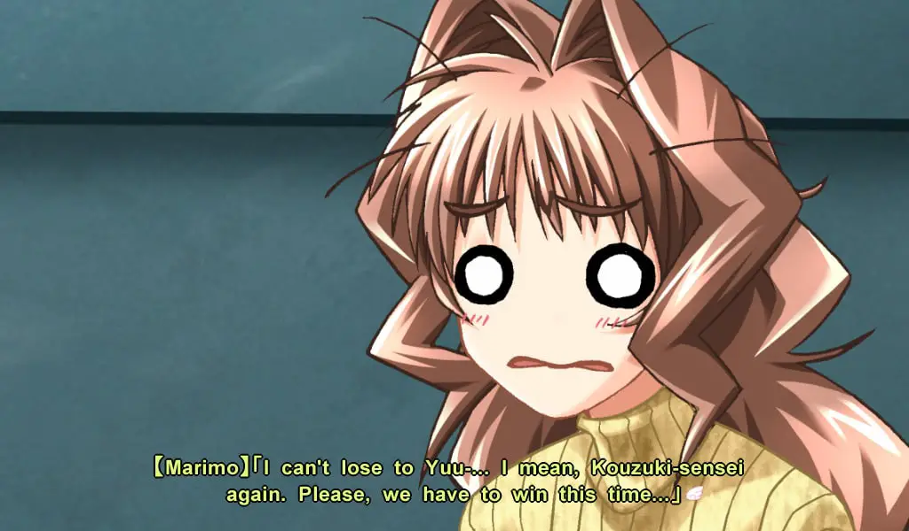
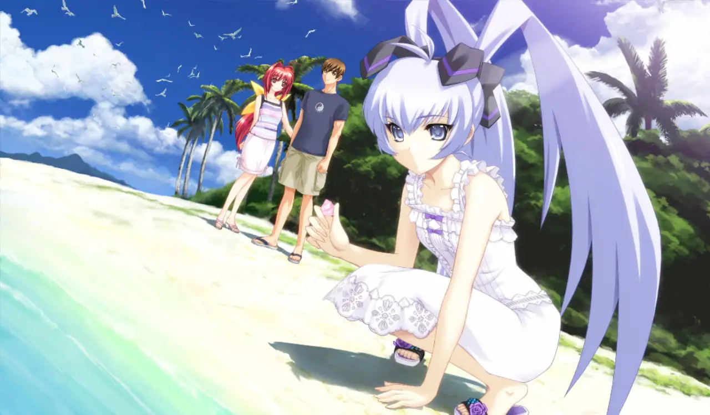

---
{
	title: "Muv-Luv photonmelodies♮ Review – Lighthearted Fun",
	published: "2020-08-19T10:16:30-07:00",
	ogLink: "https://noisypixel.net/muv-luv-photonmelodies-review-pc/"
}
---

The *Muv-Luv* series is considered to be some of the most highly regarded visual novel’s to come west, with *Muv-Luv Alternative,* in particular being the highest-rated one of the highest ranted on [VNDB](https://vndb.org/v92). The series manages these feats with a combination of an immersive world, compelling narratives, and lovable characters. For those who can’t help but want to be with these characters for a little bit longer, *Muv-Luv photonmelodies* is here with some additional stories to supplement your cravings. 

[Muv Luv photonmelodies Review - Noisy PIxel](https://www.youtube.com/embed/ZEilWoAfORQ?feature=oembed)

*Muv-Luv* is a series that finds a way to immerses the reader in its narrative through a profoundly rooted plot and alternative timelines (In the past, I[ wrote an opinion piece](https://rockmandash12.kinja.com/rockmandash-rambles-why-i-loved-muv-luv-but-you-might-1566859006) on what makes the series great). Both fandisc collections, *photonflowers\** and *photonmelodies, *expand on the relationships within the series with added context and sub-plots.

That said, I’d highly recommend you play the base games first, which I [reviewed](https://rockmandash12.kinja.com/rockmandash-reviews-muv-luv-extra-alternative-visua-1567978967). I’m going to assume that everyone reading this review is at least familiar with those games, so expect some minor spoilers, and terms that won’t make any sense without context from the series. 

<!-- ezoic_video_placeholder-under_first_paragraph-640x360-999998-clearholder -->

<!-- ezoic_video_placeholder-under_first_paragraph-640x360-999998-nonexxxclearxxxblock -->

<!-- ezoic_video_placeholder-under_first_paragraph-426x240-999998-clearholder -->

<!-- ezoic_video_placeholder-under_first_paragraph-426x240-999998-nonexxxclearxxxblock -->

<!-- ezoic_video_placeholder-under_first_paragraph-384x216-999998-clearholder -->

<!-- ezoic_video_placeholder-under_first_paragraph-384x216-999998-nonexxxclearxxxblock -->

These *photon* collections are anthologies, comprising mostly of *Muv-Luv Alternative Chronicles, *which make up short stories about people and places in the *Alternative* universe. The first release*, *[*photonflowers\**](https://noisypixel.net//muv-luv-photonflowers-review-pc/) has the bulk of them, with *Atonement, Inheritance, Chicken Divers *(this one’s my favorite of the side stories), *Rain Dancers*, and* Confessions*. When it comes to *photonmelodies, *fans get two more titles,* Adoration* and *Resurrection*. In the big scheme of things, we’re still missing localizations of *War Ensemble*, *Last Divers*, and Unlimited’s *The Day After* series, but at the very least, we’ll get [*The Day After*](https://noisypixel.net//muv-luv-unlimited-the-day-after-coming-west-pc-2020/)[ later this year](https://noisypixel.net//muv-luv-unlimited-the-day-after-coming-west-pc-2020/). 

Presentation-wise, *photonmelodies *reuses assets from the previous games. This is common practice in fandiscs, so if you enjoyed the illustrations from those titles, well, there’s more of that here. The soundtrack throughout the stories complements nearly every scene for an immersive experience that fans will appreciate. Basically, if you thought the previous games looked good or bad, nothing here will change your mind.

<!-- ezoic_video_placeholder-under_second_paragraph-640x360-999997-clearholder -->

<!-- ezoic_video_placeholder-under_second_paragraph-640x360-999997-nonexxxclearxxxblock -->

<!-- ezoic_video_placeholder-under_second_paragraph-426x240-999997-clearholder -->

<!-- ezoic_video_placeholder-under_second_paragraph-426x240-999997-nonexxxclearxxxblock -->

<!-- ezoic_video_placeholder-under_second_paragraph-384x216-999997-clearholder -->

<!-- ezoic_video_placeholder-under_second_paragraph-384x216-999997-nonexxxclearxxxblock -->

So let’s dive into* photonmelodies, Adoration *takes place in the *Alternative* timeline following Seijurou, an up and coming officer from Japan while in Europe, there’s just… uh one thing to be said: he’s a delusional chuuni idiot. This arc isn’t really like the rest of *Alternative *as it takes on very comedic tone, capturing the coming of age experience that we had with* Unlimited,* and it has tons of harem antics.

<!-- ezoic_video_placeholder-mid_content-640x360-999996-clearholder -->

<!-- ezoic_video_placeholder-mid_content-640x360-999996-nonexxxclearxxxblock -->

<!-- ezoic_video_placeholder-mid_content-426x240-999996-clearholder -->

<!-- ezoic_video_placeholder-mid_content-426x240-999996-nonexxxclearxxxblock -->

<!-- ezoic_video_placeholder-mid_content-384x216-999996-clearholder -->

<!-- ezoic_video_placeholder-mid_content-384x216-999996-nonexxxclearxxxblock -->

Humor is subjective, however, and personally, the humor in this route is not really my thing. If you like the more over-the-top campy kind of humor, then you’ll like this short story, but it is an acquired taste. I did appreciate the super-deformed art that pops up regularly in this route, and it does eventually get serious, but that’s after a lot of slice-of-life antics. This makes the cast of *Adoration* endearing, and seeing how they usually interact contrasted with the behavior of when they are fighting against BETA is worthwhile, but the slice-of-life portions themselves are hit-or-miss.

Moving on to *Resurrection**, *we get more of what you’d expect from *Alternative Chronicles. *This story follows Silvio, an EU spy who’s assigned to the Yokohama base that the regular mainline games are set in to learn more about the Alternative IV. This arc is mostly focused on the Valkyries, who are goofing around with Silvio, which creates a lighthearted atmosphere. As a result, this arc comes across more in line with* Alternative *because it keeps the wackiness grounded in comparison to what is found in* Adoration*.*Resurrection* does have it’s *Alternative* moments that get serious, mostly found in the beginning and the end. I think those alone are worth playing through the more playful scenarios. The opening has some incredible world-building, some of the best that the* Alternative Chronicles* has to offer. It’s the first and only time in which we’ve had any world building in regards to the EU and Africa, and it includes a discussion about faith in a world that god’s forsaken, which is a really nice touch and makes the stark differences between the world of *Alternative* and the one we’re familiar with. The end of the arc deals with the title itself, reflecting on the past and the regrets one may have with life. It also has a pretty killer twist, that was really engaging to read through.

The last story that is in *photonmelodies *is *Muv-Luv Altered Fable: A Shimmering Shard of Spacetime*. *Altered Fable *is the fandisc official sequel to *Muv-Luv: Alternative* and the real meat to *photonmelodies*, being much larger than the chronicles entries while also being more critical. *Altered Fable* ends up being a slice-of-life rom-com similar to *Extra*, instead of featuring the high tension scenes of *Alternative*. That doesn’t mean that there aren’t elements from *Alternative*, as this is the same Takeru from that timeline, but he’s without the memories of that route. There are lingering elements from the world of* Alternative*, mainly from Kasumi, but for the most part, it’s just a fun slice-of-life romantic comedy. 

Personally, I’m not a huge fan of *Altered Fable* as a concept, because it’s a game that stems entirely from a choice that the end of *Alternative* made that I was quite mixed on. Sure, Takeru can enjoy the happy life he deserves in the original world. Still, for me, I felt like the choice undermines the actions taken in *Alternative *and erases the memories and growth from that world, which is why I never dove into *Altered Fable’s* story much until now. 

<!-- ezoic_video_placeholder-long_content-640x360-999995-clearholder -->

<!-- ezoic_video_placeholder-long_content-640x360-999995-nonexxxclearxxxblock -->

<!-- ezoic_video_placeholder-long_content-426x240-999995-clearholder -->

<!-- ezoic_video_placeholder-long_content-426x240-999995-nonexxxclearxxxblock -->

<!-- ezoic_video_placeholder-long_content-384x216-999995-clearholder -->

<!-- ezoic_video_placeholder-long_content-384x216-999995-nonexxxclearxxxblock -->

In practice, though, *Altered Fable* is a lot of fun, legitimately having some of the most compelling slice-of-life moments of storytelling in a visual novel. After reading, I found *Altered Fable* to be significantly more enjoyable than *Extra *my first-time through. While it’s nice to see this cast in a happy environment, more importantly, the dialogue is on point, and the scenarios bring the quality of *Altered Fable* to another level.

It’s one of the few slice-of-life rom-com titles that seem to have the audience’s engagement in mind, as it’s aware of it’s pacing and every moment is enjoyable, which is something I can’t say for many in the genre. In particular, I enjoyed the interactions between Takeru, Sumika, and Kasumi, something we never really saw in the other games. The more extensive cast from *Alternative* helps a lot, and I genuinely found *Altered Fable* funny, as everyone has great chemistry, and the gags work well.

*Muv-Luv photonmelodies make* up a collection of fandiscs that takes the *Muv-Luv* series in a few new directions. Each story gives us more insight into this world, with the notable inclusion of *Altered Fable*. Most of the storytelling comes from a lighthearted perspective, but the pacing is on point for each title, and some of the scenarios make up my favorite in the series. The comedic elements might not always stick, but *photonmelodies* nails its delivery with excellent character writing and a few good plot points.

<!-- ezoic_video_placeholder-longer_content-640x360-999994-clearholder -->

<!-- ezoic_video_placeholder-longer_content-640x360-999994-nonexxxclearxxxblock -->

<!-- ezoic_video_placeholder-longer_content-426x240-999994-clearholder -->

<!-- ezoic_video_placeholder-longer_content-426x240-999994-nonexxxclearxxxblock -->

<!-- ezoic_video_placeholder-longer_content-384x216-999994-clearholder -->

<!-- ezoic_video_placeholder-longer_content-384x216-999994-nonexxxclearxxxblock -->