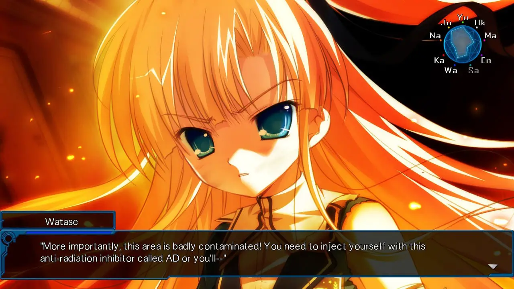
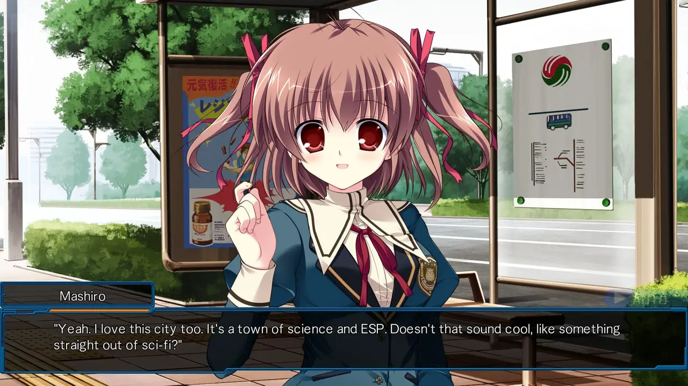
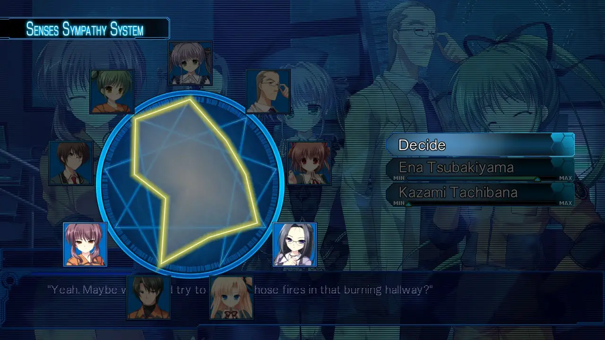
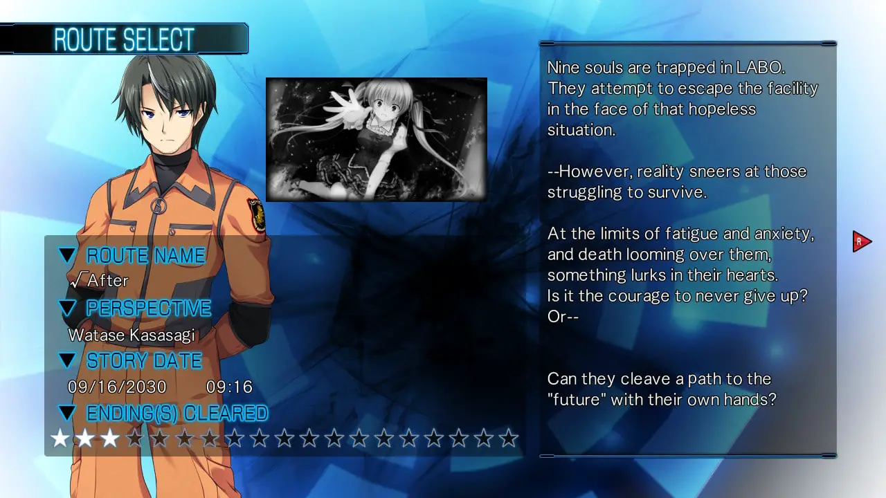
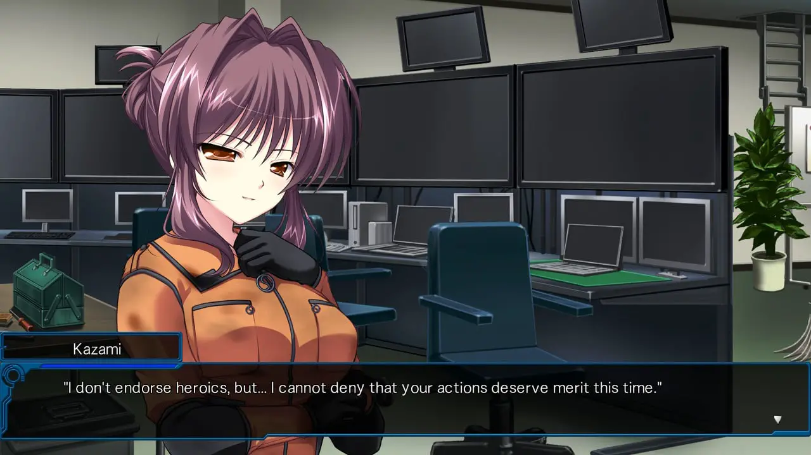
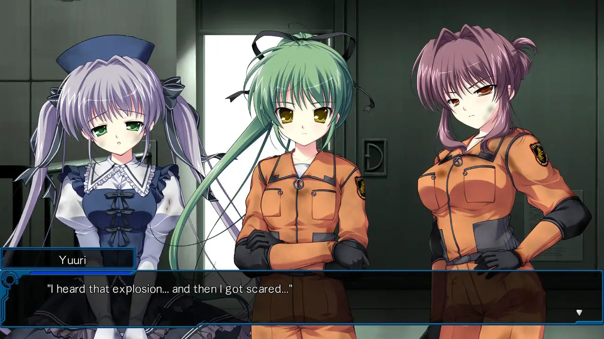

---
{
	title: "Root Double: Before Crime * After Days Xtend Edition Switch Review – Why Not One More Time?",
	published: "2020-11-30T09:42:22-08:00",
	ogLink: "https://noisypixel.net/root-double-before-crime-after-days-xtend-edition-review-switch/"
}
---

The impending doom of being trapped inside a facility with no clear explanation is a tried-and-true premise that I can’t help but enjoy every time I see it, and *Root Double: Before Crime \* After Days *happens to use these themes as a foundation for an excellent sci-fi mystery. Written by Takumi Nakazawa, of *Ever 17* fame, this phenomenal piece of fiction finds its way onto Nintendo Switch. Still, it prioritizes the main story to the point that it can hinder one’s experience of the work.

<!-- ezoic_video_placeholder-under_first_paragraph-640x360-999998-clearholder -->

<!-- ezoic_video_placeholder-under_first_paragraph-640x360-999998-nonexxxclearxxxblock -->

<!-- ezoic_video_placeholder-under_first_paragraph-426x240-999998-clearholder -->

<!-- ezoic_video_placeholder-under_first_paragraph-426x240-999998-nonexxxclearxxxblock -->

<!-- ezoic_video_placeholder-under_first_paragraph-384x216-999998-clearholder -->

<!-- ezoic_video_placeholder-under_first_paragraph-384x216-999998-nonexxxclearxxxblock -->

*Root Double: Before Crime \* After Days’ *narrative drastically changes throughout the game. The story focuses on a few different perspectives that completely alters how the premise is viewed. Set in the year 2030 in Rokumei City, On September 16th, the nuclear facility LABO undergoes a nuclear meltdown, and to prevent leakage, the facility shuts down its doors.

<!-- ezoic_video_placeholder-under_second_paragraph-640x360-999997-clearholder -->

<!-- ezoic_video_placeholder-under_second_paragraph-640x360-999997-nonexxxclearxxxblock -->

<!-- ezoic_video_placeholder-under_second_paragraph-426x240-999997-clearholder -->

<!-- ezoic_video_placeholder-under_second_paragraph-426x240-999997-nonexxxclearxxxblock -->

<!-- ezoic_video_placeholder-under_second_paragraph-384x216-999997-clearholder -->

<!-- ezoic_video_placeholder-under_second_paragraph-384x216-999997-nonexxxclearxxxblock -->

Unfortunately, this safety mechanism puts our cast of characters at risk of death due to excessive exposure. They are trapped inside, but the story is much more than just an escape story. Several elements that give *Root Double* its own unique identity include psychic powers, unreliable narrators, and a mysterious setting that features a future world that has drastically diverged from our current worldline. In particular, the mystery is handled well and adds so much to one’s engagement and experience of the game.

This premise works exceedingly well with a core foundation that also manages to be incredibly flexible. Root Double is ambitious with its story: it tries to play around with unreliable narration, it deals with the nature of society and racism, it questions what it truly means to be human, it deals with people on the brink of insanity, it goes through the nature of trusting others, etc. This may leave you feeling overwhelmed, but every idea it tries to float around is integrated well, with a good example being the Senses Sympathy System, which essentially integrates trust into granular controls for the decision making process.

*Root Double* is primarily based on mystery and tension. It utilizes the medium to its fullest potential, implementing perspective in a near-impossible way to achieve in other mediums. There’s an engaging and immersive experience here that I wish every visual novel could accomplish. The general experience is akin to getting into a great book that you don’t want to put down, which I often look for in visual novels.

<!-- ezoic_video_placeholder-mid_content-640x360-999996-clearholder -->

<!-- ezoic_video_placeholder-mid_content-640x360-999996-nonexxxclearxxxblock -->

<!-- ezoic_video_placeholder-mid_content-426x240-999996-clearholder -->

<!-- ezoic_video_placeholder-mid_content-426x240-999996-nonexxxclearxxxblock -->

<!-- ezoic_video_placeholder-mid_content-384x216-999996-clearholder -->

<!-- ezoic_video_placeholder-mid_content-384x216-999996-nonexxxclearxxxblock -->

That being said, *Root Double* has its share of issues. One of the main problems is Root Double has a consistent story with an inconsistent experience: many of the criticisms one may have during their playthrough of Root Double often contribute to some payoff later. Another would be a confusing presentation: for example, the second route (√B) is mostly a slice-of-life route, but it flip-flops between two different timelines, one past and one present. In the context of the experience, the best way to do this would be to be a linear, chronological experience that is consistent. Still, they went back and forth because they wanted to execute a specific plot twist. This twist was fantastic, but they could have managed it better in a way that did not compromise the experience.

<!-- ezoic_video_placeholder-long_content-640x360-999995-clearholder -->

<!-- ezoic_video_placeholder-long_content-640x360-999995-nonexxxclearxxxblock -->

<!-- ezoic_video_placeholder-long_content-426x240-999995-clearholder -->

<!-- ezoic_video_placeholder-long_content-426x240-999995-nonexxxclearxxxblock -->

<!-- ezoic_video_placeholder-long_content-384x216-999995-clearholder -->

<!-- ezoic_video_placeholder-long_content-384x216-999995-nonexxxclearxxxblock -->

Other aspects that are also irritating are the literal exposition dumps in-class lectures on common knowledge topics (ex: nuclear radiation)  instead of the elements that the writers made up. The explanations on aspects like BC, a mechanic that the story revolves around, are even worse because they break suspension of disbelief. This game aims to portray a realistic world, but some of their science comes out as nonsense, and how they time the events in their history doesn’t always work out. These issues probably won’t ruin your experience, but it can definitely take you out of the immersion.

*Root Double*’s gameplay is primarily through the Senses Sympathy System, which integrates trust themes into your decision-making process. There is a little circle on the top-right corner, and when used, you’ll need to dial a sense value on a slider based on how much you trust each character and how much emotion and awareness you think the characters need to have. While doing this, you also need to consider the importance of the decision, which is indicated by the color of the lines, with blue being not that important, yellow being caution, and red being a life or death situation.

That being said, while it’s well-integrated into the story, it is essentially a glorified and overly-convoluted choice system that can be a bit frustrating. This is due to some fundamental flaws to the system, which make it unclear what you’re doing. You are just picking a value from min to max. You never have any idea what your value does. It’s inconsistent at times, combining senses, emotions, and trust into one system in a way that is impossible to know what any of it does.

This system may seem cool from a story perspective, but it’s another example of the narrative over experience, a frustrating system that *Root Double* probably would have been better without. Well, it kind of is, given that you can play through any given route with regular decisions after you finish it, and the experience is much better.

<!-- ezoic_video_placeholder-longer_content-640x360-999994-clearholder -->

<!-- ezoic_video_placeholder-longer_content-640x360-999994-nonexxxclearxxxblock -->

<!-- ezoic_video_placeholder-longer_content-426x240-999994-clearholder -->

<!-- ezoic_video_placeholder-longer_content-426x240-999994-nonexxxclearxxxblock -->

<!-- ezoic_video_placeholder-longer_content-384x216-999994-clearholder -->

<!-- ezoic_video_placeholder-longer_content-384x216-999994-nonexxxclearxxxblock -->

The route structure of *Root Double* is worth mentioning, as the story is broken up into five separate routes, √A through √E, in a linear fashion. They all build up to a satisfying conclusion but make sure that you start from √A even though the game gives you the option to start at √B.

Each route has its own bad ends, which are really quite engaging and worth playing through, so I highly recommend you check them out. The bad ends rarely take that long, and you are shown how to find the true route after. So, even though the weird choice system might be frustrating, the gameplay portions don’t hinder the overall experience too much.

<!-- ezoic_video_placeholder-longest_content-640x360-999993-clearholder -->

<!-- ezoic_video_placeholder-longest_content-640x360-999993-nonexxxclearxxxblock -->

<!-- ezoic_video_placeholder-longest_content-426x240-999993-clearholder -->

<!-- ezoic_video_placeholder-longest_content-426x240-999993-nonexxxclearxxxblock -->

<!-- ezoic_video_placeholder-longest_content-384x216-999993-clearholder -->

<!-- ezoic_video_placeholder-longest_content-384x216-999993-nonexxxclearxxxblock -->

*Root Double* has a great presentation, but this is a bit of a double-edged sword. It looks objectively nice with everything appearing sharp and clean, and has aged rather well since its original release in 2012. Still, I’d be hard-pressed to say that it was overly impressive because of its simplistic style. *Root Double* represents the atmosphere and setting well, but the visuals aren’t what stand out about the game.

The sound follows the same philosophy and manages to do its job, but doesn’t stand out too much. While the music is fine, most of the OST is either slice-of-life or atmospheric themed. There were songs like “Rondo Carrousel” that had me humming along, but nothing else really did. Still, Root Double makes this rather tolerable and is effective at getting you to feel the story’s emotions.

I have to mention the switch port: it’s great and probably my new favorite way to revisit the game. Honestly, it looks as nice as the PC version, looking great both docked and handheld. On handheld mode, I have to mention that the touch screen works to progress the story, which is something I really like to see on switch VNs but isn’t always there. The only annoying thing about the switch port is that button mapping is a bit bizarre (Y opens the menu, for example), and it took me a while to get used to.

*Root Double: Before Crime \* After Days* is an engaging science fiction visual novel that I’d consider a must-play title in the genre, and the Switch version has become one of the best ways to experience it. Small systems hold it back from being better, such as confusing gameplay, suspension of disbelief breaking, and exposition dumping. Still, with its compelling narrative beats, engaging writing, and creative concepts, you’ll find it difficult to put this one down.